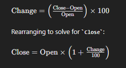

Preventing overfitting and stopping the training of an RNN model at the right time is crucial for building a robust model. Here are some strategies you can use:

### 1. **Early Stopping**

Early stopping is a technique used to halt the training process when the model's performance on a validation set starts to degrade, indicating potential overfitting. You can implement early stopping using Keras' `EarlyStopping` callback.

#### Example Code

```python
from keras.callbacks import EarlyStopping

# Define EarlyStopping callback
early_stopping = EarlyStopping(
    monitor='val_loss',        # Monitor validation loss
    patience=10,               # Number of epochs to wait for improvement
    restore_best_weights=True  # Restore model weights from the best epoch
)

# Fit the model with EarlyStopping callback
history = model.fit(
    X_train, y_train,
    epochs=50,
    batch_size=32,
    validation_split=0.1,
    callbacks=[early_stopping], # Add EarlyStopping callback
    verbose=1
)
```

- **`monitor`**: The metric to monitor for early stopping. Typically `val_loss` or `val_accuracy`.
- **`patience`**: Number of epochs to wait for an improvement in the monitored metric before stopping training. If the monitored metric doesn’t improve for this many epochs, training will stop.
- **`restore_best_weights`**: Whether to restore the model weights from the epoch with the best value of the monitored metric.

### 2. **Regularization**

Regularization techniques help prevent overfitting by penalizing large weights. In RNNs, you can use:

- **Dropout**: Randomly setting a fraction of input units to 0 during training.
  
  ```python
  from keras.layers import Dropout
  
  model.add(SimpleRNN(units=50, activation='tanh', return_sequences=True, input_shape=(50, 10)))
  model.add(Dropout(0.2))  # Apply Dropout
  ```

- **L2 Regularization**: Adding a penalty for large weights to the loss function.
  
  ```python
  from keras.regularizers import l2
  
  model.add(SimpleRNN(units=50, activation='tanh', return_sequences=True, input_shape=(50, 10),
                      kernel_regularizer=l2(0.01)))  # Apply L2 regularization
  ```

### 3. **Use a Validation Set**

Always use a validation set to monitor how the model performs on unseen data. This helps in assessing whether the model is overfitting to the training data.

```python
history = model.fit(
    X_train, y_train,
    epochs=50,
    batch_size=32,
    validation_split=0.1,  # Use 10% of training data as validation data
    verbose=1
)
```

### 4. **Cross-Validation**

Cross-validation helps ensure that the model performs well across different subsets of the data. For time series, you might use techniques like time series cross-validation.

### 5. **Model Complexity**

- **Reduce Model Complexity**: Simplify the model architecture by reducing the number of RNN layers or units if overfitting is observed.
  
  ```python
  model.add(SimpleRNN(units=20, activation='tanh', return_sequences=True, input_shape=(50, 10)))
  ```

### 6. **Data Augmentation**

If possible, augment your data to provide more training examples. For time series data, this could involve techniques such as jittering or adding noise.

### 7. **Batch Normalization**

Apply normalization to each batch to stabilize learning and reduce overfitting.

```python
from keras.layers import BatchNormalization

model.add(SimpleRNN(units=50, activation='tanh', return_sequences=True, input_shape=(50, 10)))
model.add(BatchNormalization())  # Apply Batch Normalization
```

### 8. **Checkpoints**

Save model checkpoints at intervals during training. This helps in restoring the model to the best state in case of overfitting.

```python
from keras.callbacks import ModelCheckpoint

checkpoint = ModelCheckpoint('best_model.h5', monitor='val_loss', save_best_only=True)

history = model.fit(
    X_train, y_train,
    epochs=50,
    batch_size=32,
    validation_split=0.1,
    callbacks=[checkpoint],  # Save best model
    verbose=1
)
```

### Summary

To stop training and prevent overfitting in an RNN model, you can:

1. **Use Early Stopping**: Automatically stop training when performance on a validation set starts to degrade.
2. **Apply Regularization**: Use techniques like Dropout and L2 regularization.
3. **Utilize a Validation Set**: Monitor the model’s performance on unseen data.
4. **Simplify Model Complexity**: Reduce the number of layers or units if overfitting is observed.
5. **Apply Data Augmentation**: Increase the diversity of training data if possible.
6. **Use Batch Normalization**: Stabilize learning and improve generalization.
7. **Save Checkpoints**: Restore the model to the best state during training.

Implementing these strategies can help improve the generalization of your RNN model and avoid overfitting.


The formula you provided computes the percentage change between the `Close` and `Open` prices using their logarithmic values. Here’s a breakdown of what this calculation does and how to interpret it:

### Understanding the Formula

```python
data['Change'] = (np.log(data['Close']) - np.log(data['Open'])) * 100
```

- **`np.log(data['Close'])`**: Takes the natural logarithm of the `Close` price.
- **`np.log(data['Open'])`**: Takes the natural logarithm of the `Open` price.
- **Difference**: Subtracts the logarithm of the `Open` price from the logarithm of the `Close` price.
- **Multiply by 100**: Converts the result to a percentage change.

### Why Use Logarithms?

Using logarithms for percentage changes has several benefits:

1. **Normalization**: Logarithmic returns are often more normally distributed compared to raw returns, which can be beneficial for statistical modeling.
2. **Symmetry**: Logarithmic returns are symmetric; a 1% increase and a 1% decrease are treated equivalently in terms of their percentage change.
3. **Time Series Properties**: Log returns are additive over time. For example, the return over two periods is the sum of the returns of the individual periods.

### Reconstructing `Close` Prices from Changes

If you want to reconstruct the `Close` prices from the computed `Change` values, you need to reverse the percentage change calculation. This typically involves reversing any transformations applied and using the percentage change to compute the `Close` prices.

### Reconstructing Example

Suppose you have the percentage changes and need to reconstruct `Close` prices:

1. **Transform Change to Decimal Form**:
   Convert percentage changes back to decimal form by dividing by 100.

2. **Apply Changes to Reconstruct Prices**:
   Use the starting `Open` price to compute the `Close` price. If `Change` is the percentage change, it means:




### Python Example

Here’s how you can do it in Python:

```python
# Assuming 'data' DataFrame has 'Open' and 'Change' columns

# Compute Close prices from Open and Change
data['Reconstructed_Close'] = data['Open'] * (1 + data['Change'] / 100)

# View the updated DataFrame
print(data[['Open', 'Change', 'Reconstructed_Close']].head())
```

### Summary

- The formula `(np.log(data['Close']) - np.log(data['Open'])) * 100` computes the percentage change based on the log differences of `Close` and `Open` prices.
- To reconstruct `Close` prices from percentage changes, use the formula \(\text{Close} = \text{Open} \times \left(1 + \frac{\text{Change}}{100}\right)\).


This approach assumes that you have a time series where `Open` prices are known and `Change` represents the percentage change computed from the logarithmic values.